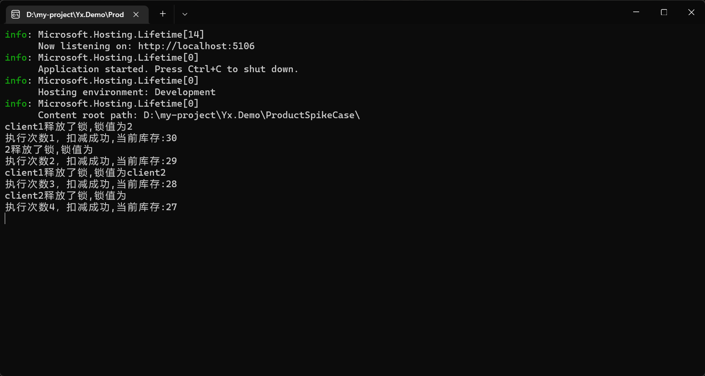

## 使用 StringSetAsync 和 Lua 脚本与 LockTakeAsync 有什么区别？

使用 StringSetAsync 和 Lua 脚本与 LockTakeAsync 和 LockReleaseAsync 在实现分布式锁的逻辑上有所不同，但它们都能实现同样的功能。以下是两者的区别和各自的优缺点：

StringSetAsync 和 Lua 脚本

- 优点：
  - 灵活性：可以自定义锁的逻辑，例如通过 Lua 脚本检查锁的持有者。
  - 透明性：你可以清楚地看到和控制锁的实现细节。
- 缺点：
  - 复杂性：实现上稍微复杂一些，需要编写 Lua 脚本来确保原子性操作。
  - 维护性：因为是自定义实现，维护上可能需要更多的注意。

LockTakeAsync 和 LockReleaseAsync

- 优点：
  - 简洁性：API 简洁易用，减少了编写和维护自定义代码的负担。
  - 可靠性：是 Redis 官方提供的方法，经过充分测试，可靠性较高。
- 缺点：
  - 灵活性：较低的灵活性，无法像 Lua 脚本那样自定义锁的行为。

**总结：**

如果你需要更多的灵活性和控制力（例如，自定义锁逻辑、检查锁的持有者等），使用 StringSetAsync 和 Lua 脚本可能更适合你。
如果你希望实现简单且可靠的分布式锁，那么 LockTakeAsync 和 LockReleaseAsync 是更好的选择，因为它们是 Redis 官方提供的高层次 API，使用起来更方便且可靠。


## 锁失效问题，问题根源，A线程加的锁，被B线程释放了？

初始化时，redis锁设置为10s，client1先进来执行业务代码由于某些原因执行超过了10s，那么client1加的锁就过期了。此时client2进来了并加了锁，而client1执行完成了去释放锁，此时释放的锁是client2的锁（此时client2还没有执行完），从而导致client3进来了，之后client2又把client3的锁释放了。此时如果代码设置库存使用的是`StringSet`则会出现超卖现象。


**代码模拟：**

```c#
		[HttpPost]
        public async Task<string> AddOrder(string clientId)
        {
            string msg = null;
            //string clientId = Guid.NewGuid().ToString();
            // 设置锁
            var isSuccess = await SetLockVersionAsync(clientId);
            if (isSuccess)
            {
                try
                {
                    // 获取库存
                    int invQty = GetInvQty();
                    if (invQty > 0)
                    {
                        invQty = invQty - 1;
                        // 设置库存
                        SetInvQty(invQty);
                        // 模拟线程超时
                        Thread.Sleep(15000);
                        msg = $"执行次数{count++}，扣减成功,当前库存:{invQty}";
                    }
                    else
                    {
                        msg = $"执行次数{count++}，扣减失败,库存不足";
                    }
                }
                finally
                {
                    await UnLockVersionAsync(clientId);
                }
            }
            else
            {
                msg = $"执行次数{count++}，资源正忙,请刷新后重试";
            }
            Console.WriteLine(msg);
            return msg;
        }
        
        private async Task<bool> UnLockVersionAsync(string value)
        {
            var client = await _redisDb.StringGetAsync("LockValue");
            Console.WriteLine($"{value}释放了锁,锁值为{client}");
            return await _redisDb.KeyDeleteAsync("LockValue");
        }
```

**操作过程：**

打开两个swagger，触发第一个请求后，等10秒钟。用另一个swagger发出第二个请求。结果如下：



**解决办法：**在释放锁时，判断这把锁是否来自于这个客户端，但这样也只能解决锁被误释放问题，并不能解决锁超时问题

```c#
private async Task<bool> UnLockVersionAsync(string value)
        {
            return await _redisDb.KeyDeleteAsync("LockValue");
            var script = @"
            if redis.call('GET', KEYS[1]) == ARGV[1] then
                return redis.call('DEL', KEYS[1])
            else
                return 0
            end";
            var result = (int)await _redisDb.ScriptEvaluateAsync(script, new RedisKey[] { "LockValue" }, new RedisValue[] { value });
            return result == 1;
        }
```

## 如何防止锁超时过期造成超卖？

当扣减库存使用`StringSet`来实现时：

在分布式环境中，假设有服务端1、2，库存为2。

有3个请求并发，然后请求1发送到服务器1卡住了，此时请求1获取到了库存，但还未完成扣减更新库存，并且锁超时过期了。然后剩下的请求都发到了服务端2，并下单成功，库存更新为0，然后请求1完成了请求，由于请求1获取到的库存为2，因此仍然下单成功，并且又将库存更新为1，那么下一个请求过来还能下单成功一个，这样就超卖了2个。因此不能使用StringSet，因为这样会导致库存更新出现错误。

**解决办法：**

使用redis自带的自减功能：

- 请求到来时会先获取库存，如果库存小于0或小于扣减数量则直接提示库存不足。
- 如果库存满足条件，但是在扣减库存前服务端卡住了，此时库存被其他请求在其他服务端扣减完了，当前卡住的请求在执行redis脚本自减时会扣减失败，从而不会出现超卖情况
- 即使使用自减也必须加上库存判断，否则在某一个锁超时的情况下则会出现自减到负数，也是超卖了。

```c#
private async Task<bool> SetInvQtyAsync(int qty)
        {
            //使用脚本执行redis自减操作，当库存小于扣减库存时，则不进行自减
            var script = @"
                local currentQty = tonumber(redis.call('GET', KEYS[1]))
                local qtyToDecrement = tonumber(ARGV[1])
                if currentQty and currentQty >= qtyToDecrement then
                    redis.call('DECRBY', KEYS[1], qtyToDecrement)
                    return 1
                else
                    return 0
                end
            ";

            var result = (int)await _redisDb.ScriptEvaluateAsync(script, new RedisKey[] { "InvQty" }, new RedisValue[] { qty });
            return result == 1;
        }
```

## 解决锁过期问题

对于是否需要实现续租机制还有待研究，目前感觉如果做续租，如果请求超时执行而去续租会长时间占用锁，这样会导致在并发下单的时候让下单成功率降低，在第一个请求获取锁超时后续租，其他请求都无法下单成功。